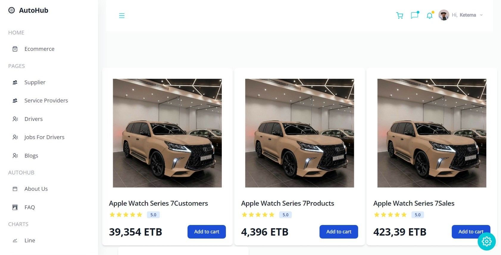

# Welcome! 👋
***Thank you for choosing `Autohub` - we're here to make `car care` easy and stress-free for you.***
## AutoHub
`Autohub` is a web application designed to provide a centralized vehicle service for car repair, a blog to learn about vehicles, and an e-commerce platform to buy cars or accessories. The goal of `Autohub` is to provide a ***one-stop solution for all things related to cars.***
## Features
### Vehicle Service
`Autohub` provides a comprehensive vehicle service for car repairs. Users can create an account, schedule appointments, and track their repair progress. The service includes a database of local mechanics and repair shops, as well as a rating system to help users choose the best mechanic for their needs.

### E-commerce
Finally, `Autohub` includes an e-commerce platform where users can buy cars and accessories. The platform features a search function to help users find the car or accessory they need, as well as a secure checkout process.

### Job for Drivers
`Autohub` also provides a job feature for drivers. Drivers can create a profile, view available jobs, and apply for them. The feature also includes a rating system to help drivers choose the best jobs for their needs.

### Blog
`Autohub` also includes a blog section where users can learn about vehicles, maintenance, and other car-related topics. The blog is regularly updated with new articles and features a commenting system for users to engage with the content.
## Getting Started
To use `Autohub`, simply visit the website at `www.Autohub.com` and create an account. From there, you can schedule a vehicle repair appointment, browse the blog for car-related information, and shop for cars and accessories.

## Technologies Used
`Autohub` was built using the following technologies:

- TailwindCSS
- JavaScript
- React
- Node.js
- Express
- MongoDB

## Contributors

`Autohub` was developed by the following team of software engineers and designers:
1. Ketema Girma
2. Betselot Tadele
3. Gatwech Tap
4. Dema Amano

***If you have any questions or feedback, please contact us at `contact@autohub.com.`**